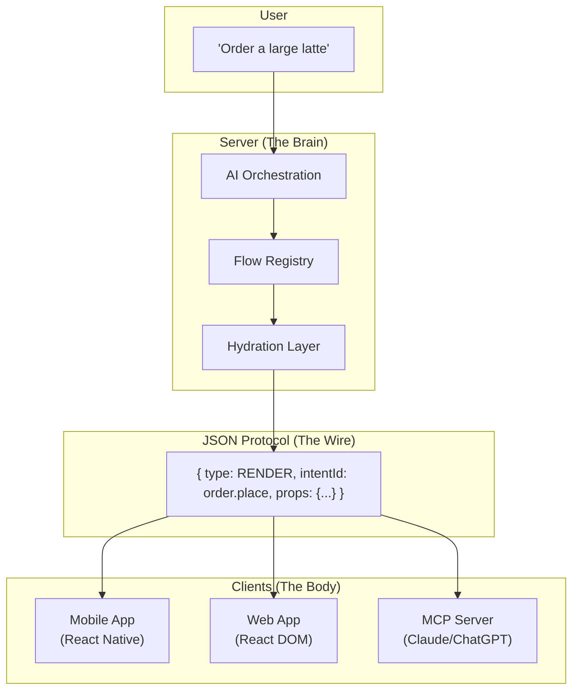
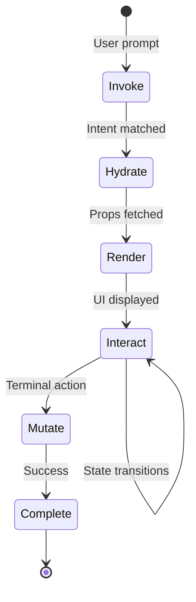

# IntentFlow

**A Protocol for AI-Orchestrated Applications**

> Build applications where AI orchestrates real UI—not hallucinated widgets.

---

## The Problem

We're building AI into our applications wrong.

```
┌─────────────────────────────────────────────────────────────────────────────┐
│                                                                             │
│   TRADITIONAL APPS                 CHATBOTS                                 │
│   ────────────────                 ────────                                 │
│   ✓ Real UI                        ✗ Text-only or fake widgets              │
│   ✓ Type-safe                      ✗ Hallucinated responses                 │
│   ✓ Business logic                 ✗ No real integration                    │
│   ✗ Rigid navigation               ✓ Natural language                       │
│   ✗ Manual discovery               ✓ Conversational                         │
│                                                                             │
│                        What if you could have both?                         │
│                                                                             │
└─────────────────────────────────────────────────────────────────────────────┘
```

**Traditional apps** are powerful but rigid. Users must learn navigation hierarchies to accomplish tasks.

**Chatbots** are flexible but shallow. They generate text responses or ephemeral widgets with no real connection to your business logic. Users don't trust them for real transactions.

## The Solution

**IntentFlow** is a protocol that lets AI orchestrate your real application UI.

```
User: "Order my usual"
         │
         ▼
┌─────────────────┐     ┌─────────────────┐     ┌─────────────────┐
│                 │     │                 │     │                 │
│   AI matches    │────▶│  Server builds  │────▶│  Client renders │
│   intent to     │     │  props from     │     │  native UI      │
│   "order.place" │     │  your database  │     │  component      │
│                 │     │                 │     │                 │
└─────────────────┘     └─────────────────┘     └─────────────────┘
                                                        │
                                                        ▼
                                               ┌─────────────────┐
                                               │ ┌─────────────┐ │
                                               │ │ Order       │ │
                                               │ │ ─────────── │ │
                                               │ │ Cappuccino  │ │
                                               │ │ Large, Oat  │ │
                                               │ │             │ │
                                               │ │[Place Order]│ │
                                               │ └─────────────┘ │
                                               │    Your real    │
                                               │    React UI     │
                                               └─────────────────┘
```

The AI doesn't generate UI—it **selects** from pre-built, type-safe Flows you control.

---

## How It Works

### The Architecture



| Layer | Responsibility |
|-------|----------------|
| **Brain** | AI matches intents, fetches data, manages state |
| **Wire** | JSON protocol defines what to render—not how |
| **Body** | Native UI per platform (mobile, web, MCP) |

### The Flow

A **Flow** is the core primitive—a self-contained unit of functionality:

```typescript
// Definition: What data is needed + what states are valid
export const placeOrderFlow = defineFlow({
  intentId: 'order.place',

  schema: z.object({
    items: z.array(orderItemSchema),
    location: z.object({ name: z.string(), estimatedTime: z.number() }),
    paymentMethods: z.array(paymentMethodSchema),
  }),

  machine: createMachine({
    initial: 'review',
    states: {
      review: { on: { CONFIRM: 'processing', CANCEL: 'cancelled' } },
      processing: { on: { SUCCESS: 'confirmed', FAILURE: 'error' } },
      confirmed: { type: 'final' },
      error: { on: { RETRY: 'processing' } },
      cancelled: { type: 'final' },
    },
  }),
})
```

```tsx
// Component: How it renders (universal React)
export function PlaceOrderFlow() {
  const props = useFlowProps()
  const state = useFlowState()
  const dispatch = useFlowDispatch()

  if (state.matches('review')) {
    return (
      <Card>
        <OrderSummary items={props.items} />
        <Button onPress={() => dispatch('CONFIRM')}>Place Order</Button>
      </Card>
    )
  }
  // ... other states
}
```

### The Protocol Message

The server sends JSON instructions—not HTML, not code:

```json
{
  "type": "RENDER",
  "intentId": "order.place",
  "instanceId": "flow_abc123",
  "props": {
    "items": [{ "name": "Cappuccino", "size": "large", "price": 4.50 }],
    "location": { "name": "123 Main St", "estimatedTime": 8 },
    "paymentMethods": [{ "id": "pm_1", "label": "Visa ••4242" }]
  },
  "displayMode": "fullscreen"
}
```

The client looks up `order.place` in its component registry and renders your real UI.

---

## Why IntentFlow?

### vs. Traditional Apps

| Traditional | IntentFlow |
|-------------|------------|
| Open app → Menu → Drinks → Lattes → Customize → Add to cart | "Order a large oat milk latte" |
| Navigate to Orders → Find order → Tap for details | "Where's my order?" |
| Same UI components, rigid navigation | Same UI components, instant access |

### vs. Chatbots

| Chatbots | IntentFlow |
|----------|------------|
| AI generates text/widgets | AI selects your real components |
| "I can help you order..." (text only) | Renders actual order form |
| Hallucination risk | Constrained to registered Flows |
| No real business logic | Full state machines, type-safe props |

### The Benefits

**For Developers:**
- **Write once, render everywhere** — Same Flow works on mobile, web, and MCP
- **Type-safe end-to-end** — Zod schemas validate props, XState governs transitions
- **Separation of concerns** — AI logic on server, UI on client, protocol bridges them

**For Business:**
- **Brand consistency** — AI uses your exact design system, not generic widgets
- **Safety** — AI cannot hallucinate actions outside your Flow Registry
- **Future-proof** — Your Flows become tools for Claude, ChatGPT, and future agents via MCP

---

## Universal Rendering

One Flow definition renders appropriately on every platform:

```
┌─────────────────────────────────────────────────────────────────────────────┐
│                            order.place Flow                                 │
├─────────────────────┬─────────────────────┬─────────────────────────────────┤
│                     │                     │                                 │
│   📱 Mobile         │   💻 Web            │   🤖 MCP (Claude)               │
│   (React Native)    │   (React DOM)       │   (HTML)                        │
│                     │                     │                                 │
│  ┌───────────────┐  │  ┌───────────────┐  │  ┌─────────────────────────┐    │
│  │ Review Order  │  │  │ Review Order  │  │  │ ## Order Summary        │    │
│  │               │  │  │               │  │  │                         │    │
│  │ Cappuccino    │  │  │ Cappuccino    │  │  │ - Cappuccino (large)    │    │
│  │ Large · $4.50 │  │  │ Large · $4.50 │  │  │   $4.50                 │    │
│  │               │  │  │               │  │  │                         │    │
│  │ [Place Order] │  │  │ [Place Order] │  │  │ Ready in ~8 min         │    │
│  │               │  │  │               │  │  │                         │    │
│  │ Native View   │  │  │ DOM Element   │  │  │ Say "confirm" to order  │    │
│  └───────────────┘  │  └───────────────┘  │  └─────────────────────────┘    │
│                     │                     │                                 │
└─────────────────────┴─────────────────────┴─────────────────────────────────┘
```

---

## Technical Overview

### Recommended Stack

| Layer | Technology |
|-------|------------|
| Schemas | [Zod](https://zod.dev) — Runtime validation |
| State Machines | [XState](https://xstate.js.org) — Finite state logic |
| Universal UI | [Tamagui](https://tamagui.dev) or React Native Web |
| AI Orchestration | Vercel AI SDK, LangChain, or direct LLM APIs |
| Transport | HTTP, WebSocket, SSE, or MCP |

### Protocol Messages

| Message | Direction | Purpose |
|---------|-----------|---------|
| `RENDER` | Server → Client | Display a Flow |
| `TRANSITION` | Server → Client | Update Flow state |
| `PROPS_UPDATE` | Server → Client | Patch props (streaming) |
| `EVENT` | Client → Server | User interaction |
| `DISMISS` | Server → Client | Remove a Flow |
| `ERROR` | Server → Client | Error with recovery options |

### Flow Lifecycle



---

## Documentation

Deep-dive into the concepts, protocol, and implementation guides:

### Concepts
- **[Philosophy](./docs/philosophy.md)** — Why Intent-Driven Architecture
- **[Flows](./docs/concepts/flows.md)** — The core primitive explained
- **[Intents](./docs/concepts/intents.md)** — Matching and entity extraction
- **[Registry](./docs/concepts/registry.md)** — Discovery, permissions, versioning
- **[Rendering](./docs/concepts/rendering.md)** — Universal UI model

### Protocol
- **[Overview](./docs/protocol/overview.md)** — Design principles
- **[Messages](./docs/protocol/messages.md)** — Complete message reference
- **[Transport](./docs/protocol/transport.md)** — HTTP, WebSocket, SSE, MCP
- **[Errors](./docs/protocol/errors.md)** — Error handling patterns

### Guides
- **[Building Flows](./docs/guides/building-flows.md)** — Step-by-step tutorial
- **[AI Orchestration](./docs/guides/ai-orchestration.md)** — LLM integration patterns
- **[MCP Integration](./docs/guides/mcp-integration.md)** — Claude/ChatGPT tools

---

## Status

IntentFlow is in **active specification development**.

We're defining the protocol, APIs, and reference patterns. Implementation packages are planned but not yet released.

### Roadmap

- [x] Core specification
- [x] Protocol message format
- [x] Documentation
- [ ] `@intentflow/core` — Schema and state machine utilities
- [ ] `@intentflow/react` — React bindings and hooks
- [ ] `@intentflow/ui` — Universal component primitives
- [ ] `@intentflow/mcp` — MCP server adapter
- [ ] Reference implementation

### Get Involved

This is an open specification. We welcome:

- **Feedback** on the protocol design
- **Use cases** we should consider
- **Contributions** to documentation and specification
- **Discussion** about implementation approaches

Open an [issue](https://github.com/oojacoboo/intent-flow/issues) or start a [discussion](https://github.com/oojacoboo/intent-flow/discussions).

---

## Quick Comparison

```
┌────────────────────┬────────────────────┬────────────────────┐
│   TRADITIONAL      │   CHATBOT          │   INTENTFLOW       │
├────────────────────┼────────────────────┼────────────────────┤
│                    │                    │                    │
│   User taps        │   User types       │   User types       │
│   Menu → Drinks    │   "order coffee"   │   "order coffee"   │
│   → Lattes → ...   │        │           │        │           │
│        │           │        ▼           │        ▼           │
│        ▼           │   AI generates     │   AI selects       │
│   Finally finds    │   text response    │   order.place Flow │
│   the order form   │        │           │        │           │
│        │           │        ▼           │        ▼           │
│        ▼           │   "I can help      │   ┌──────────┐     │
│   ┌──────────┐     │    you order a     │   │ Order    │     │
│   │ Order    │     │    coffee! What    │   │ ──────── │     │
│   │ ──────── │     │    size?"          │   │ Latte    │     │
│   │ Latte    │     │                    │   │ Large    │     │
│   │ Large    │     │   (no UI, just     │   │ $4.50    │     │
│   │ $4.50    │     │    back & forth)   │   │          │     │
│   │          │     │                    │   │ [Order]  │     │
│   │ [Order]  │     │                    │   └──────────┘     │
│   └──────────┘     │                    │                    │
│                    │                    │                    │
│   Real UI ✓        │   No actions ✗     │   Real UI ✓        │
│   Rigid nav ✗      │   Flexible ✓       │   Flexible ✓       │
│   Your design ✓    │   Generic ✗        │   Your design ✓    │
│                    │                    │                    │
└────────────────────┴────────────────────┴────────────────────┘
```

---

<p align="center">
  <strong>IntentFlow</strong> — The protocol for AI-orchestrated applications.
  <br/>
  <a href="./docs">Documentation</a> · <a href="https://github.com/oojacoboo/intent-flow/issues">Issues</a> · <a href="https://github.com/oojacoboo/intent-flow/discussions">Discussions</a>
</p>

---

**License:** MIT
