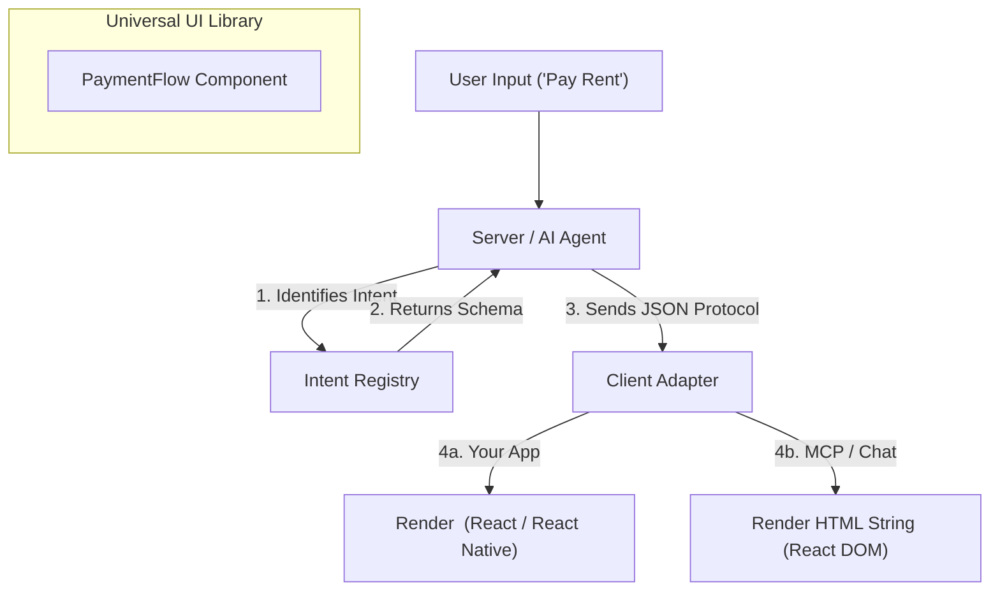

# IntentFlow

### Map Natural Language to UI Flows.

**A Framework for Server-Driven, AI-Orchestrated Applications.**

---

## 💡 The Problem

AI Agents are powerful, but relying on them to build user interfaces is risky.

* **Standard Chatbots** generate hallucinated HTML widgets that don't look like your brand or connect to your app's state.
* **Standard Apps** force users to manually navigate deep menus to find features.

## 🚀 The Solution: IntentFlow

**IntentFlow** is an orchestration engine that allows your AI Agent (Server) to "drive" your application by mapping natural language intents to strict, pre-defined UI flows.

* **Server-Driven Intent:** The Logic and State live securely on the server.
* **Zero Hallucinations:** The AI selects from a strict registry of components; it never "invents" the UI.
* **Universal Runtime:** Define your flow *once*. Run it inside your **Mobile/Web App** OR inside **Claude/ChatGPT** (via MCP).

---

## 🏗 Architecture

IntentFlow uses a "Shared Brain, Universal Body" architecture.



### The "Intent Protocol" (JSON)

Instead of sending code over the wire, IntentFlow sends **Instructions**. This keeps payloads tiny, secure, and platform-agnostic.

```json
{
  "type": "RENDER",
  "component": "tenant.payment_card",
  "props": {
    "amount": 1200,
    "recipient": "RentPost Property Mgmt",
    "dueDate": "2026-02-01"
  },
  "displayMode": "modal"
}

```

---

## 💻 Usage

### 1. Define the Intent (The Brain)

Create a strict contract for what the AI is allowed to do.

```typescript
// packages/core/flows/payment.config.ts
import { defineFlow } from '@intentflow/core';
import { z } from 'zod';

export const PaymentFlow = defineFlow({
  id: 'tenant.pay_rent',
  description: 'Initiates a rent payment workflow',
  schema: z.object({
    amount: z.number().describe('The amount to pay in USD'),
    dueDate: z.string().date()
  })
});

```

### 2. Build the Component (The Body)

Use standard React components. These can be shared across your web dashboard, mobile app, and MCP server.

```tsx
// packages/ui/flows/PaymentCard.tsx
import { View, Text, Button } from '@intentflow/primitives';

export const PaymentCard = ({ amount, dueDate }) => (
  <View style={{ padding: 20 }}>
    <Text style={{ fontSize: 18 }}>Pay ${amount}</Text>
    <Text style={{ color: 'gray' }}>Due: {dueDate}</Text>
    <Button onPress={() => submitPayment()}>Confirm</Button>
  </View>
);

```

### 3. Register & Orchestrate (The Runtime)

**In Your Application:**
The app loads the registry and listens for the protocol.

```tsx
// apps/client/App.tsx
import { IntentRenderer } from '@intentflow/react';
import { PaymentCard } from '@my-org/ui';

const registry = {
  'tenant.pay_rent': PaymentCard
};

export default function App() {
  const { currentIntent } = useIntentFlow(); // Listens to Server
  
  if (!currentIntent) return <ChatInterface />;
  
  return <IntentRenderer config={currentIntent} registry={registry} />;
}

```

---

## 🔌 Supported Runtimes

| Runtime | Technology | Output | Use Case |
| --- | --- | --- | --- |
| **Mobile App** | React Native / Expo | IOS/Android Views | Your core product experience. |
| **Web Dashboard** | Next.js / React | DOM Elements | Your standard SaaS web app. |
| **MCP Server** | Node.js + `ext-apps` | HTML String | Rendering UI inside Claude, Cursor, or ChatGPT. |

---

## ❓ FAQ

**Q: How is this different from Vercel AI SDK / A2UI?**
A: Those tools focus on *Generative UI* (letting the AI invent the layout). **IntentFlow** focuses on *Application Orchestration*. We believe business software requires strict adherence to design systems and legal flows. The AI chooses the *Component*, not the *CSS*.

**Q: Do I need to use React Native?**
A: No. While IntentFlow works perfectly with React Native for mobile apps, you can use standard React DOM for web-only or MCP-only implementations. The protocol is agnostic.

**Q: Can I use this with any Agent?**
A: Yes. IntentFlow is model-agnostic. It works with OpenAI, Anthropic, Gemini, or local Llama models.

---

## 🗺 Roadmap

* [ ] **Core:** Define strict JSON Protocol schema.
* [ ] **SDK:** Release `@intentflow/react` hooks.
* [ ] **Adapter:** Build standard MCP Server adapter for rendering React to HTML strings.
* [ ] **CLI:** `npx intentflow create` scaffolding tool.

---

## 🤝 Contributing

We are currently in the **Alpha** conceptual phase.
Discussions, PRs, and architectural proposals are welcome in the Issues tab.

**License:** MIT
